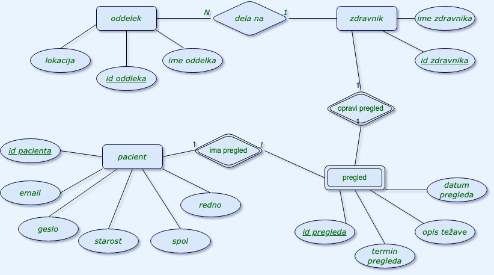

# OPB-eZdravnik

**E-zdravnik** je projekt, izdelan v okviru predmeta **Osnove podatkovnih baz**. Gre za preprosto spletno aplikacijo, ki omogoča naročanje pacientov na zdravniški pregled.

## Funkcionalnosti

- Uporabnik se lahko prijavi v svoj profil kot pacient.
- Izbere lahko želeni **oddelek** ali neposredno **zdravnika**, ki na njem dela.
- Na voljo so prosti **termini za pregled**, med katerimi uporabnik izbere ustreznega.
- Ob rezervaciji termina lahko uporabnik **vpiše opis težav**, zaradi katerih prihaja na pregled.
- Vsak pregled je zabeležen skupaj z datumom, terminom in povezavo na zdravnika in pacienta.
  
##  ER diagram

Spodaj je prikazan ER-diagram aplikacije, ki prikazuje strukturo podatkovne baze, na kateri aplikacija temelji:

